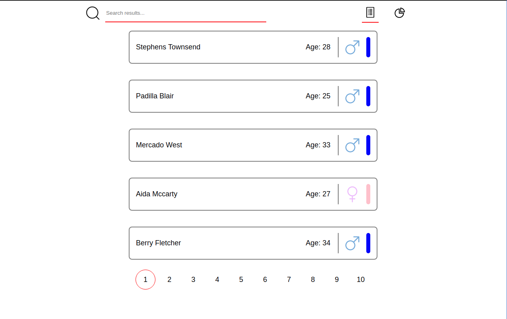

# Suade

### Introduction

This is a test made for Suade Labs for the position of the Frontend Developer.

**Author: Konstantinos Tsirakos**

### How to install

1. Clone project using git

    ```jsx
    git clone https://github.com/Ktsirakos/saude-test.git
    ```

2. Open cloned folder

    ```jsx
    cd saude-test //(or any other name you gave for the folder)
    ```

3. Install dependencies

    ```jsx
    npm install
    ```

### How to run the project

1. Run development 

    ```jsx
    npm run serve
    ```

2. Open your browser to

    ```jsx
    http://localhost:8080/
    ```

Expected view:



### How to test

1. E2E testing (Cypress)
    - Application contains 5 people at first page
    - Application render correct number of pages (50 people - 10 pages)
    - Only one page can be selected at the time
    - Searching reducing results
    - Application can switch from **graphs view** to **list view** back and forth
    - Check that all graphs are presented

    ```jsx
    npm run test:e2e
    ```

2. Unit testing (Jest)
    - Renders UI correctly
    - On click opens edit fields
    - On re-click closes edit fields

    ```jsx
    npm run test:unit
    ```

### Future work

1. Better animations on state change
2. Better layout for graphs
3. Refactoring PersonRow component to make easier to read

### Troubleshooting

- No problems were discovered when testing the procedure
